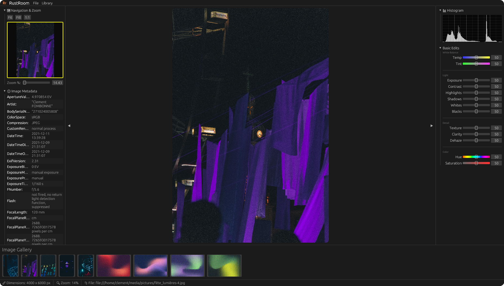

# RustRoom 📸

RustRoom is a lightweight, non-destructive photo management and editing application built entirely in Rust.



This project was created as a hands-on journey to learn the Rust ecosystem, specifically focusing on GUI development with `egui`, high-performance image processing, and local data persistence with SQLite.

> **Note:** This project is currently in a very early stage of development.

## ✨ Features

- **Non-Destructive Editing Engine:** A modular pipeline for photo adjustments including Exposure, Contrast, Saturation, Temperature, Tint, Texture, Clarity, and Dehaze.
- **Background Processing:** A dedicated worker thread system ensures the UI remains responsive even during complex image re-renders.
- **Smart Cataloging:** SQLite-powered database to manage image metadata, albums, and import history.
- **Real-time Histogram:** Live-updating luminance histogram to assist with exposure adjustments.
- **Interactive Viewer:** A zoomable and pannable central viewport with auto-fit capabilities.
- **Metadata Extraction:** Automatically reads and displays EXIF data (Camera model, focal length, ISO, etc.) using `kamadak-exif`.
- **Cross-Platform Storage:** Follows OS standards for application data storage (using `directories` crate).

## 🛠 Tech Stack

- **UI Framework:** [egui / eframe](https://github.com/emilk/egui)
- **Image Processing:** [image](https://github.com/image-rs/image)
- **Database:** [rusqlite](https://github.com/rusqlite/rusqlite) (SQLite)
- **Metadata:** [kamadak-exif](https://github.com/hMatoba/kamadak-exif-rust)
- **Serialization:** [serde](https://serde.rs/)

## 🚀 Getting Started

### Prerequisites

You will need the Rust toolchain installed. If you are on a Linux system with Nix, a `shell.nix` is provided for your convenience.

### Development Environment (Nix)
```bash
nix-shell
```

### Running the App
```bash
cargo run --release
```
*Note: Using `--release` is highly recommended for image processing performance.*

## 📂 Project Structure

- `src/database/`: SQLite schema, album management, and image record persistence.
- `src/engine/`: The core render pipeline, adjustment math, and background worker logic.
- `src/ui/`: The modular GUI components (panels, viewers, sliders).
- `assets/`: Application icons and branding.

## 🔮 Future Development

- **GPU Acceleration (wgpu):** Transition the image processing pipeline from the CPU to GPU-based shaders for real-time responsiveness on high-resolution photos.
- **Enhanced Library Management:** Advanced filtering, tagging, and hierarchical album organization.
- **Local Adjustments:** Implementation of masking tools (brushes, gradients) for targeted edits.
- **AI-Powered Object Removal:** Intelligent content-aware fill to remove unwanted elements from images.

## ⚖️ License

This project is for educational purposes. Feel free to explore the code!
